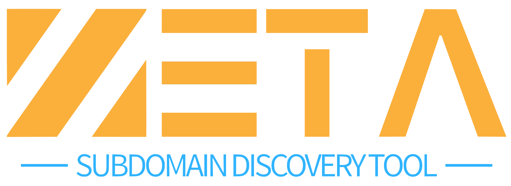

  

    
    
    

## 📜 Description

**Zeta** is a **Subdomain Discovery Tool** designed to perform domain scanning and subdomain enumeration. Zeta helps in identifying subdomains associated with a given domain, which is essential for security testing, asset discovery, and reconnaissance activities.

### Key Features:

- **Subdomain Enumeration**: Perform scans to discover subdomains linked to the target domain.
- **Efficient Scanning**: Quickly find subdomains using advanced scanning techniques.
- **Detailed Output**: Provides a comprehensive list of discovered subdomains with optional IP addresses and other metadata.
- **User-Friendly CLI**: Command-line interface designed for easy and efficient subdomain discovery, offering flexible options for customization.

### Learning Objectives:

- **Understanding Subdomain Discovery**: Gain knowledge about the role of subdomain enumeration in cybersecurity and penetration testing.
- **Python Programming**: Enhance skills in Python programming, particularly in web scraping, API requests, and HTML parsing.
- **Network Reconnaissance**: Learn techniques for asset discovery and security testing in real-world scenarios.

**Note**: Zeta is intended for educational purposes and should be used responsibly in compliance with cybersecurity laws and ethical guidelines.

## 📚 Reference Data
- **[crt.sh](https://crt.sh/)**: A Certificate Transparency log search engine that provides visibility into SSL/TLS certificates. It helps in discovering subdomains through certificates issued to a domain.
- **[Subdomain Finder](https://subdomainfinder.c99.nl/)**: A web-based tool for discovering subdomains of a given domain. It performs subdomain enumeration and provides results in a user-friendly interface.

## 📽️ Demo Tools

  

