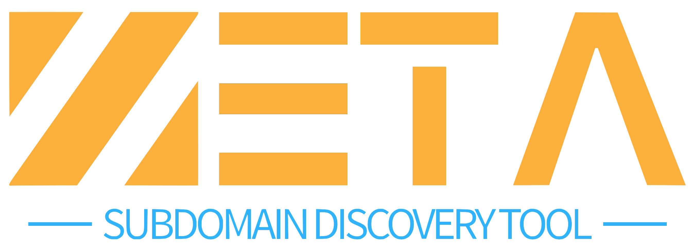

<p align="center">
  
</p>

<p align="center">
    
    
    
</p>

## 📜 Description

**Zeta** is a **Subdomain Discovery Tool** designed to help identify subdomains associated with a specific domain. Instead of performing direct enumeration, Zeta leverages data from subdomain finder services to provide relevant subdomain information. This tool is essential for security testing, asset discovery, and reconnaissance activities.

### Key Features:

- **Subdomain Data Retrieval**: Fetches subdomain information from providers such as CRT.SH and Subdomain Finder.
- **Fast Processing**: Utilizes APIs or scraping methods to quickly retrieve subdomain data.
- **Detailed Output**: Provides a comprehensive list of discovered subdomains with optional metadata such as IP addresses.
- **User-Friendly CLI**: A command-line interface designed for flexible and efficient subdomain discovery.

### Learning Objectives:

- **Understanding Subdomain Discovery**: Learn about the importance of subdomain discovery in security testing and penetration testing.
- **Python Programming**: Improve Python programming skills, particularly in web scraping, API requests, and HTML parsing.
- **Network Reconnaissance**: Master techniques for asset discovery and security testing in real-world scenarios.

**Note**: Zeta is intended for educational purposes and must be used responsibly in compliance with cybersecurity laws and ethical guidelines.


## ⚙️ Installation

### Using pipx (Recommended)
`pipx` is a tool to install and run Python applications in isolated environments. Follow these steps to install Zeta:

1. Install pipx:
   ```bash
   sudo apt install pipx
   pipx ensurepath
   ```

2. Clone the Zeta repository:
   ```bash
   git clone https://github.com/sh4dowByte/zeta.git
   cd zeta
   ```

3. Install Zeta using pipx:
   ```bash
   pipx install .
   ```

### Alternative Setup - Using Alias
If you prefer not to use `pipx`, you can set up an alias to run `zeta.py` directly from your terminal.

1. Clone the Zeta repository:
   ```bash
   git clone https://github.com/sh4dowByte/zeta.git
   cd zeta
   ```

2. Install the required dependencies from `requirements.txt`:
   ```bash
   python3 -m pip install -r requirements.txt
   ```

3. Open your terminal and add the following alias to your shell configuration file (e.g., `~/.bashrc` or `~/.zshrc`):
   ```bash
   alias zeta='python3 ~/Pentest/zeta/zeta.py'
   ```

4. After adding the alias, run `source ~/.bashrc` (or `source ~/.zshrc` for zsh) to reload your shell configuration.

Now, you can run `zeta` directly from your terminal!


## 📚 Reference Data

- **[crt.sh](https://crt.sh/)**: A Certificate Transparency log search engine providing visibility into SSL/TLS certificates. It helps in discovering subdomains through certificates issued to a domain.
- **[Subdomain Finder](https://subdomainfinder.c99.nl/)**: A web-based tool for discovering subdomains of a given domain. It performs subdomain enumeration and provides results in a user-friendly interface.

## 📽️ Tool Demo

<p align="center">
  
</p>